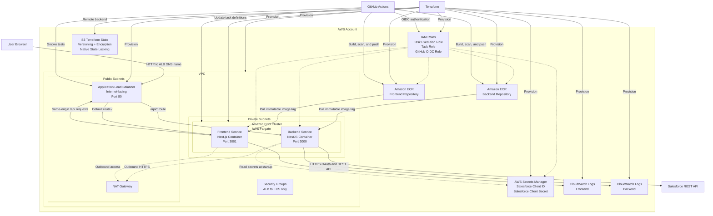
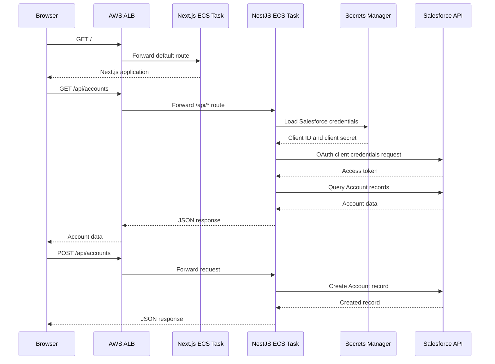
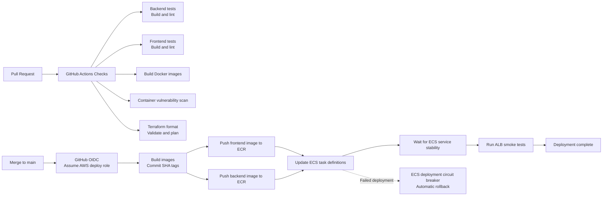
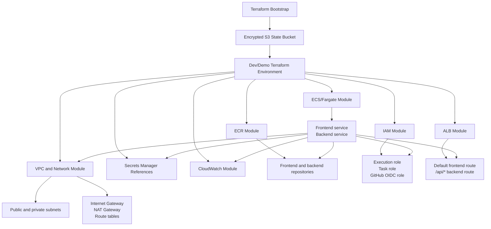

# AWS Deployment Architecture

This document shows the proposed AWS deployment for the Salesforce Account Manager.

The first implementation phase is intentionally limited to the diagrams below. Terraform, CI/CD, and application deployment changes will be added only after this architecture is approved.

## AWS Infrastructure

## Request Flow

## CI/CD Flow

## Terraform Resource Relationships

## Key Security Boundaries

- Only the Application Load Balancer is publicly reachable.
- Frontend and backend ECS tasks run in private subnets without public IP addresses.
- The backend task accepts traffic only from the ALB security group.
- Salesforce credentials are stored in Secrets Manager and are never included in frontend code or Docker images.
- The backend is the only component that communicates with Salesforce.
- GitHub Actions uses OIDC instead of long-lived AWS access keys.
- ECS deployments use immutable image tags based on the Git commit SHA.
