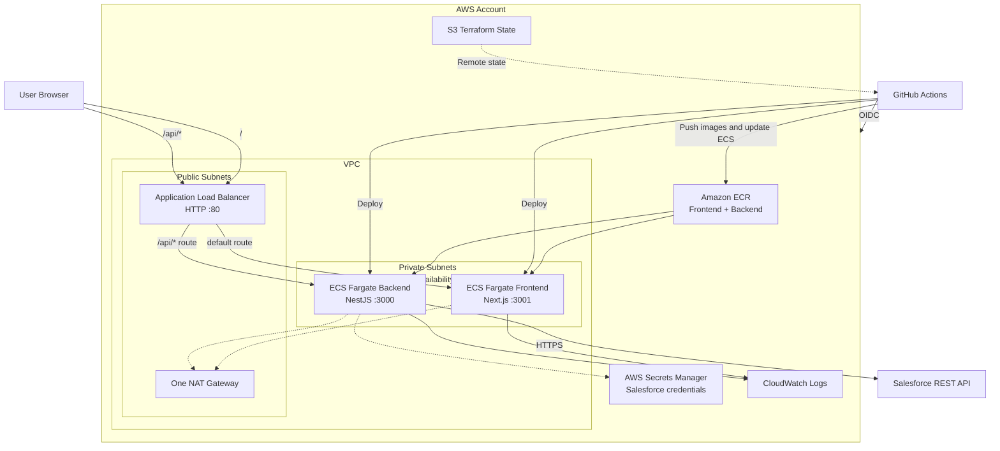

# AWS and Terraform Deployment Guide

This guide summarizes the AWS architecture, Terraform configuration, GitHub Actions CI/CD design, IAM/OIDC setup, Salesforce secret handling, deployment workflow, cost controls, and troubleshooting lessons for the Salesforce Account Manager.

The deployment is designed as a temporary interview/demo environment. It demonstrates cloud and DevOps practices without introducing Kubernetes, a database, or unnecessary application infrastructure.

## 1. Deployment Goals

The deployment must:

- Run the Next.js frontend and NestJS backend as containers.
- Keep Salesforce credentials server-side.
- Route all browser API traffic through the backend.
- Provision AWS infrastructure with Terraform.
- Build and deploy application images through GitHub Actions.
- Use GitHub OIDC instead of long-lived AWS access keys.
- Support a repeatable `terraform destroy` cleanup.
- Keep recurring cost low enough for short development and interview sessions.

The application remains stateless. Salesforce is the system of record, so no RDS, DynamoDB, Redis, or application database is required.

## 2. Target Architecture

The selected architecture is ECS Fargate behind one public Application Load Balancer.



### Why ECS Fargate

ECS Fargate is appropriate for this application because it provides:

- Managed container execution without EC2 host management.
- A strong cloud-native story without Kubernetes operational overhead.
- Native integration with ECR, ALB, CloudWatch, IAM, and Secrets Manager.
- A small infrastructure footprint suitable for a temporary demo.

EKS would demonstrate Kubernetes, but it would add control-plane, node, networking, and operational complexity that is not justified by two stateless containers.

### Why one ALB

One ALB provides a single browser origin:

```text
GET /          -> frontend target group
GET /api/*     -> backend target group
POST /api/*    -> backend target group
```

This avoids exposing a second public backend URL and reduces CORS complexity. The frontend is built with the ALB URL as its API base URL.

### Network boundary

- The ALB is internet-facing in public subnets.
- ECS tasks run in private subnets without public IP addresses.
- The frontend task accepts traffic only from the ALB security group on port `3001`.
- The backend task accepts traffic only from the ALB security group on port `3000`.
- Private tasks use one NAT gateway for outbound access to ECR, CloudWatch, Secrets Manager, and Salesforce.

## 3. Repository Structure

The infrastructure is organized as follows:

```text
infra/
├── README.md
├── bootstrap/
│   ├── main.tf
│   ├── outputs.tf
│   ├── providers.tf
│   ├── terraform.tfvars.example
│   ├── variables.tf
│   └── versions.tf
├── environments/
│   └── dev/
│       ├── backend.tf.example
│       ├── main.tf
│       ├── outputs.tf
│       ├── terraform.tfvars.example
│       ├── variables.tf
│       └── versions.tf
└── modules/
    ├── alb/
    ├── ecr/
    ├── ecs/
    ├── network/
    ├── observability/
    └── secrets/
```

The root `infra/environments/dev` configuration composes the modules. The modules remain AWS-specific and intentionally small; they are not generic multi-cloud abstractions.

## 4. Terraform State

### Is remote state required for one person?

No. Local state works for a single-person experiment. Remote state is still recommended for this project because it demonstrates:

- State surviving local machine loss.
- Consistent Terraform execution from GitHub Actions.
- Remote locking.
- Versioned state recovery.
- A production-oriented workflow that does not depend on one laptop.

The S3 storage cost for one small state file is negligible. The main state-bucket work is initial setup, not ongoing cost.

### State bucket configuration

The bootstrap stack creates an S3 bucket with:

- Versioning enabled.
- Server-side encryption using AES256.
- Public access blocked.
- Lifecycle expiration for old noncurrent versions.
- `prevent_destroy = true`.

Example backend configuration:

```hcl
terraform {
  backend "s3" {
    bucket       = "salesforce-manager-terraform-state-REPLACE-ME"
    key          = "dev/terraform.tfstate"
    region       = "us-east-1"
    encrypt      = true
    use_lockfile = true
  }
}
```

`use_lockfile = true` uses the modern S3 backend locking mechanism supported by the selected Terraform version. If a project uses an older Terraform version, DynamoDB locking may be required instead.

### Bootstrap the state bucket

The bootstrap stack uses local state once because the remote bucket does not exist yet:

```bash
export AWS_PROFILE=salesforce-manager

cd infra/bootstrap
cp terraform.tfvars.example terraform.tfvars
```

Set a globally unique bucket name:

```hcl
aws_region        = "us-east-1"
project_name      = "salesforce-manager"
environment       = "dev"
state_bucket_name = "salesforce-manager-terraform-state-REPLACE-ME"
```

Apply it:

```bash
terraform init
terraform fmt -check
terraform validate
terraform plan
terraform apply
```

Then configure the dev backend and record the same bucket as the GitHub `TF_STATE_BUCKET` repository variable:

```bash
cd ../environments/dev
gh variable set TF_STATE_BUCKET --repo <ORG>/<REPO> --body <STATE_BUCKET>
```

Initialize with the remote backend values:

```bash
AWS_PROFILE=salesforce-manager terraform init \
  -backend-config="bucket=<STATE_BUCKET>" \
  -backend-config="key=dev/terraform.tfstate" \
  -backend-config="region=us-east-1" \
  -backend-config="encrypt=true" \
  -backend-config="use_lockfile=true"
```

### State cleanup

Normal demo cleanup should destroy only the dev environment through GitHub Actions:

```bash
./scripts/destroy.sh
```

Keep the state bucket if the environment may be redeployed. Destroying the state bucket requires removing `prevent_destroy` and emptying all object versions and delete markers first.

## 5. AWS Authentication

There are two separate authentication paths.

### Local Terraform authentication

Terraform running on a laptop cannot use GitHub OIDC. It requires an AWS CLI profile or an AWS SSO session.

Profile-based setup:

```bash
aws configure --profile salesforce-manager
export AWS_PROFILE=salesforce-manager
aws sts get-caller-identity
terraform init
```

SSO-based setup is preferable when available:

```bash
aws configure sso --profile salesforce-manager
aws sso login --profile salesforce-manager
export AWS_PROFILE=salesforce-manager
aws sts get-caller-identity
```

The error below means Terraform did not find local credentials:

```text
No valid credential sources found
failed to refresh cached credentials
no EC2 IMDS role found
```

The EC2 metadata failure is expected when Terraform is running on a Mac. Set `AWS_PROFILE` or use an SSO session; do not run Terraform from an EC2 metadata fallback.

### GitHub Actions authentication

GitHub Actions uses:

```text
GitHub Actions OIDC token
    -> AWS IAM OIDC provider
    -> salesforce-manager-github-actions role
    -> ECR/ECS/Terraform permissions
```

The workflow must request an ID token:

```yaml
permissions:
  contents: read
  id-token: write
```

Do not store these in GitHub Secrets:

```text
AWS_ACCESS_KEY_ID
AWS_SECRET_ACCESS_KEY
```

## 6. GitHub OIDC and IAM

### OIDC provider

The AWS IAM OIDC provider must use:

```text
Provider URL: https://token.actions.githubusercontent.com
Audience:    sts.amazonaws.com
```

The audience is important. A malformed client ID such as:

```text
://amazonaws.com
```

causes OIDC role assumption failures.

### Role naming

The selected role name is:

```text
salesforce-manager-github-actions
```

It identifies the project, identity source, and purpose without encoding a temporary implementation detail.

### Trust policy

The GitHub token observed in this environment used an internal-ID form for the subject claim. A trust policy should match the actual claims emitted by the repository/workflow. A typical subject-based policy looks like this:

```json
{
  "Version": "2012-10-17",
  "Statement": [
    {
      "Sid": "GitHubActionsTrust",
      "Effect": "Allow",
      "Principal": {
        "Federated": "arn:aws:iam::<ACCOUNT_ID>:oidc-provider/token.actions.githubusercontent.com"
      },
      "Action": "sts:AssumeRoleWithWebIdentity",
      "Condition": {
        "StringEquals": {
          "token.actions.githubusercontent.com:aud": "sts.amazonaws.com"
        },
        "StringLike": {
          "token.actions.githubusercontent.com:sub": "<OBSERVED_GITHUB_SUB>",
          "token.actions.githubusercontent.com:job_workflow_ref": "<ORG>/<REPO>/.github/workflows/deploy.yml@refs/heads/main"
        }
      }
    }
  ]
}
```

Do not guess the `sub` value when troubleshooting. Print only non-sensitive OIDC claims such as `iss`, `aud`, `sub`, and `job_workflow_ref`; never print the JWT itself.

### `iam:*` versus least privilege

This permission is extremely broad:

```json
"iam:*"
```

It permits almost all IAM administration, including role creation, policy changes, access-key operations, and trust-policy changes. It is not deprecated, but it is not appropriate as a default deployment permission.

For ECS application deployment, the key IAM action is usually:

```json
{
  "Effect": "Allow",
  "Action": "iam:PassRole",
  "Resource": [
    "arn:aws:iam::<ACCOUNT_ID>:role/salesforce-manager-dev-ecs-execution",
    "arn:aws:iam::<ACCOUNT_ID>:role/salesforce-manager-dev-ecs-task"
  ],
  "Condition": {
    "StringEquals": {
      "iam:PassedToService": "ecs-tasks.amazonaws.com"
    }
  }
}
```

The current one-role demo approach is intentionally simple, but it should still avoid unrestricted `iam:*` and `s3:*` where possible. A production design would separate infrastructure, application deployment, and one-time bootstrap permissions.

## 7. Terraform Modules and Resources

### Network module

The network module creates:

- One VPC with DNS support and DNS hostnames enabled.
- Two public subnets across two availability zones.
- Two private subnets across two availability zones.
- Internet Gateway.
- One NAT Gateway and Elastic IP.
- Public and private route tables.
- ALB security group.
- Frontend task security group.
- Backend task security group.

The default VPC CIDR is:

```text
10.42.0.0/16
```

The single NAT gateway is a deliberate demo cost trade-off. Production high availability would normally use one NAT gateway per AZ, but that doubles the main recurring NAT cost.

### ECR module

Two private repositories are created:

```text
salesforce-manager-dev-frontend
salesforce-manager-dev-backend
```

Repository configuration includes:

- Immutable image tags.
- Scan on push.
- AES256 encryption.
- Lifecycle cleanup keeping the newest ten images.
- `force_delete = true` for temporary demo teardown.

`force_delete = true` is useful because ECR repositories containing images otherwise may fail to delete during `terraform destroy`.

### Secrets module

Terraform creates empty Secrets Manager containers:

```text
salesforce-manager-dev/sf-client-id
salesforce-manager-dev/sf-client-secret
```

Terraform does not create secret versions. This avoids placing plaintext credentials into Terraform variables, plans, state, or CI artifacts.

### ECS module

The ECS module creates:

- ECS cluster.
- ECS execution role.
- ECS task role.
- Frontend task definition and service.
- Backend task definition and service.
- CloudWatch logging configuration.
- Secrets Manager access policy for the execution role.
- ECS deployment circuit breaker with rollback.

The demo uses:

```text
CPU per task:    256 units / 0.25 vCPU
Memory per task: 512 MiB
Desired count:   1 task per service
```

The services use:

```hcl
deployment_maximum_percent         = 200
```

The low minimum healthy percentage is appropriate for a one-task temporary demo. A production service would normally use a higher minimum healthy percentage and multiple tasks.

### ALB module

The ALB module creates:

- Internet-facing ALB in public subnets.
- HTTP listener on port `80`.
- Frontend target group on port `3001`.
- Backend target group on port `3000`.
- Default listener action forwarding to frontend.
- Listener rule forwarding `/api/*` to backend.
- ALB health checks:
  - Frontend: `/` with matcher `200-399`.
  - Backend: `/api/health` with matcher `200`.

Target deregistration delay is set to thirty seconds:

```hcl
deregistration_delay = 30
```

This reduces the wait during one-task demo deployments. The default ALB delay of 300 seconds caused cancelled/stale deployments to take much longer to stabilize.

### Observability module

CloudWatch log groups are created:

```text
/ecs/salesforce-manager-dev/frontend
/ecs/salesforce-manager-dev/backend
```

Log retention is seven days by default. A basic ALB 5xx alarm is also configured.

## 8. Salesforce Secrets and Login Domain

### Secret population

Populate secret values outside Terraform:

```bash
aws secretsmanager put-secret-value \
  --profile salesforce-manager \
  --region us-east-1 \
  --secret-id salesforce-manager-dev/sf-client-id \
  --secret-string '<Salesforce client ID>'

aws secretsmanager put-secret-value \
  --profile salesforce-manager \
  --region us-east-1 \
  --secret-id salesforce-manager-dev/sf-client-secret \
  --secret-string '<Salesforce client secret>'
```

Use the command only in a secure local shell. Do not place real values in Git files, Terraform variables, GitHub repository variables, Dockerfiles, frontend build arguments, or CI logs.

Enable ECS secret injection in the local ignored `terraform.tfvars`:

```hcl
salesforce_secrets_ready = true
```

The ECS execution role receives only `secretsmanager:GetSecretValue` for the two project secret ARNs.

### Salesforce My Domain troubleshooting

A critical deployment issue occurred when local and AWS used different Salesforce login URLs.

The local Docker container used the org-specific My Domain:

```text
https://<SALESFORCE_MY_DOMAIN>.develop.my.salesforce.com
```

AWS used the generic domain:

```text
https://login.salesforce.com
```

The Salesforce client ID and secret were identical, but AWS received:

```text
400 invalid_grant
request not supported on this domain
```

The fix was to use the same org-specific My Domain in ECS:

```hcl
salesforce_login_url = "https://<SALESFORCE_MY_DOMAIN>.develop.my.salesforce.com"
```

When local works but AWS fails, compare all of these values:

- `SF_CLIENT_ID`.
- `SF_CLIENT_SECRET`.
- `SF_LOGIN_URL`.
- `SF_API_VERSION`.
- Salesforce connected-app policies.
- Network source/IP restrictions.

Credentials can be compared safely by hashing them without printing values:

```bash
printf '%s' "$SF_CLIENT_ID" | shasum -a 256
printf '%s' "$SF_CLIENT_SECRET" | shasum -a 256
```

Compare only hashes from local env files and AWS Secrets Manager. Never print the secret contents.

## 9. Two-Phase ECS Bootstrap

Terraform and container publishing have a circular dependency:

- ECS task definitions need an image.
- GitHub Actions needs ECR/ECS infrastructure before it can deploy an image.

The solution is a two-phase bootstrap.

### Phase one: infrastructure bootstrap

Terraform creates ECS services with:

```text
public.ecr.aws/docker/library/busybox:1.36
```

The placeholder container runs a small HTTP server:

- Frontend returns a placeholder page on port `3001`.
- Backend returns `{"status":"ok"}` at `/api/health` on port `3000`.

This allows ALB and ECS resources to become healthy before the application images exist.

### Phase two: real application deployment

GitHub Actions:

1. Builds the frontend and backend images.
2. Pushes them to ECR.
3. Downloads the current task definitions.
4. Replaces the image values.
5. Removes the placeholder `entryPoint`, `command`, and `healthCheck` fields.
6. Registers new task definitions.
7. Deploys both ECS services.
8. Runs ALB smoke tests.

Removing the placeholder fields is required. If the deployment action only replaces the image, the real Node.js image may still try to execute the BusyBox command:

```text
httpd: not found
exit code 127
```

The production task definition should rely on the Dockerfile `CMD`, not the bootstrap command.

## 10. GitHub Actions CI

The CI workflow runs on pull requests and pushes to `main`.

It performs:

- Backend `npm ci`.
- Backend unit tests.
- Backend build.
- Backend Prettier check.
- Backend ESLint check.
- Frontend `npm ci`.
- Frontend lint.
- Frontend build.
- Playwright browser installation.
- Frontend E2E tests.
- Backend startup for E2E tests.
- Frontend Docker build.
- Backend Docker build.

The E2E job runs on its own GitHub runner. The backend job's `node_modules` directory is not shared with the frontend job, so the frontend E2E job must explicitly install backend dependencies:

```yaml
- name: Install backend dependencies for E2E
  working-directory: ${{ github.workspace }}/backend
  run: npm ci
```

Then build and start from the repository root:

```yaml
- name: Start backend for E2E tests
  working-directory: ${{ github.workspace }}
  run: |
    npm --prefix backend run build
    npm --prefix backend run start:prod > /tmp/salesforce-manager-backend.log 2>&1 &
```

Without the backend `npm ci`, the CI failure is:

```text
nest: not found
```

The backend E2E environment uses placeholder Salesforce values because the tests mock API responses and must not access production Salesforce.

### Linux lockfile portability

`npm ci` can fail on GitHub's Linux runner if a lockfile was generated only with a local macOS ARM optional dependency. Regenerate the lockfile in a platform-portable way:

```bash
cd frontend
npm install --package-lock-only --ignore-scripts --include=optional
npm ci --ignore-scripts
```

The CI runner must be able to resolve Linux optional packages such as `lightningcss`.

## 11. GitHub Actions Application Deployment

The application deployment workflow runs on pushes to `main` and manual `workflow_dispatch` runs. The explicit full-stack workflow is started by `./scripts/deploy.sh` and intentionally bypasses this gate after Terraform succeeds.

It is protected by:

```text
DEPLOY_ENABLED=true
```

If the variable is not exactly `true`, direct application workflow runs exit safely without assuming AWS or pushing images. The explicit full-stack workflow does not require the variable to be enabled.

### Required repository variables

Configure these under GitHub repository Actions variables:

```text
AWS_REGION=us-east-1
AWS_ACCOUNT_ID=<AWS_ACCOUNT_ID>
TF_STATE_BUCKET=<TERRAFORM_STATE_BUCKET>

ECR_FRONTEND_REPOSITORY=salesforce-manager-dev-frontend
ECR_BACKEND_REPOSITORY=salesforce-manager-dev-backend

ECS_CLUSTER=salesforce-manager-dev
ECS_FRONTEND_SERVICE=salesforce-manager-dev-frontend
ECS_BACKEND_SERVICE=salesforce-manager-dev-backend

ECS_FRONTEND_TASK_DEFINITION=salesforce-manager-dev-frontend
ECS_BACKEND_TASK_DEFINITION=salesforce-manager-dev-backend

ECS_FRONTEND_CONTAINER=frontend
ECS_BACKEND_CONTAINER=backend

ALB_URL=http://<ALB_DNS_NAME>
DEPLOY_ENABLED=true
```

Do not place Salesforce credentials in these variables.

`TF_STATE_BUCKET` is the encrypted, versioned bucket created by the one-time bootstrap configuration. The GitHub workflows pass it to `terraform init`; they do not copy the `REPLACE-ME` backend example.

### Frontend build-time API URL

`NEXT_PUBLIC_API_URL` is compiled into the Next.js browser bundle. It must be passed during the Docker build:

```yaml
build-args: |
  NEXT_PUBLIC_API_URL=${{ env.ALB_URL }}
```

Setting this only as an ECS runtime variable is too late because the browser JavaScript has already been built.

### Immutable image tags

ECR repositories use immutable tags. A commit-only tag is traceable but cannot be pushed again if a workflow is retried. The workflow therefore uses:

```bash
image_tag="${GITHUB_SHA}-${GITHUB_RUN_ID}"
```

Example:

```text
<ECR_REGISTRY>/salesforce-manager-dev-frontend:<COMMIT_SHA>-<RUN_ID>
<ECR_REGISTRY>/salesforce-manager-dev-backend:<COMMIT_SHA>-<RUN_ID>
```

This keeps retries safe and makes rollback to a specific run possible.

### Deployment order

The workflow deploys frontend first and backend second:

```text
Build and push backend image
Build and push frontend image
Download task definitions
Render image values
Remove bootstrap fields
Deploy frontend and wait for stability
Deploy backend and wait for stability
Run /api/health and / smoke tests
```

The deployment workflow owns application image revisions. Terraform owns baseline infrastructure and ignores external ECS service task-definition revisions:

```hcl
lifecycle {
  ignore_changes = [task_definition]
}
```

Without this lifecycle rule, a later Terraform apply can revert ECS to the placeholder task definition.

## 12. Terraform Workflow

`.github/workflows/terraform.yml` supports:

- Terraform formatting checks.
- Bootstrap validation.
- Dev environment validation.
- Pull request plan.
- Manual plan.
- Manual apply.
- Manual destroy.

`.github/workflows/deploy-stack.yml` provides the single full-stack deployment path. It applies Terraform, reads the current ALB URL, calls the reusable application deployment workflow, and updates the non-secret `ALB_URL` repository variable.

Pull request plans are not automatically applied. Configure the GitHub `dev` Environment with required reviewers before using `apply` or `destroy`.

### Important Terraform workflow limitation

The workflow copies `terraform.tfvars.example` for CI and initializes the remote backend with `TF_STATE_BUCKET`. Non-secret deployment configuration that must be consistent across CI and local runs should therefore be represented in the example file. Secret values must not be added there.

## 13. Deployment Runbook

### First deployment

1. Configure local AWS credentials or SSO.

```bash
export AWS_PROFILE=salesforce-manager
aws sts get-caller-identity
```

2. Create the state bucket once.

```bash
cd infra/bootstrap
terraform init
terraform validate
terraform apply
```

3. Configure the GitHub repository variables, including `TF_STATE_BUCKET`, and authenticate the GitHub CLI:

```bash
gh auth login
gh variable set TF_STATE_BUCKET --repo <ORG>/<REPO> --body <STATE_BUCKET>
```

4. Create the local Salesforce environment file and verify the required variables are present:

```bash
cp backend/.env.example backend/.env
```

Set `SF_CLIENT_ID` and `SF_CLIENT_SECRET` in `backend/.env`. The deploy wrapper reads these values locally and sends them directly to AWS Secrets Manager without printing them.

5. Push the intended code to `main`.

6. Run the one-command deployment wrapper:

```bash
./scripts/deploy.sh
```

The wrapper checks whether the dev infrastructure exists. If it is missing, it dispatches Terraform apply first, waits for the empty secret containers to be created, synchronizes `backend/.env`, and then dispatches the application deployment workflow.

7. Verify:

```bash
ALB_URL=$(gh variable get ALB_URL --repo <ORG>/<REPO>)
curl "$ALB_URL/"
curl "$ALB_URL/api/health"
curl "$ALB_URL/api/accounts"
```

### Normal application release

For an application code change:

1. Open a pull request.
2. Wait for CI checks.
3. Merge to `main`.
4. GitHub Actions builds immutable images.
5. GitHub Actions deploys ECS revisions.
6. Smoke tests confirm the ALB routes.

Terraform should not be applied for every application code change.

### Infrastructure change

For a Terraform change:

1. Open a pull request changing `infra/**`.
2. Review `terraform fmt`, `validate`, and `plan`.
3. Merge after review.
4. Manually run the Terraform `apply` action from the protected environment.
5. Confirm Terraform does not plan to revert CI-managed task definitions.

## 14. Troubleshooting Guide

### Terraform cannot find credentials

Symptom:

```text
No valid credential sources found
no EC2 IMDS role found
```

Fix:

```bash
export AWS_PROFILE=salesforce-manager
aws sts get-caller-identity
terraform init
```

### State bucket already exists or is inaccessible

Check:

```bash
aws s3api head-bucket \
  --bucket <STATE_BUCKET> \
  --profile salesforce-manager \
  --region us-east-1
```

Verify:

- Bucket name is globally unique.
- AWS region is correct.
- Profile points to the expected account.
- The GitHub role has state bucket permissions.
- `backend.tf` uses the same bucket and key as the bootstrap output.

### Terraform plans to revert ECS images

Symptom:

```text
ECS service task_definition will change from the CI revision to the Terraform revision
```

Cause: Terraform and GitHub Actions both own the ECS service task definition.

Fix:

```hcl
lifecycle {
  ignore_changes = [task_definition]
}
```

Terraform owns infrastructure; GitHub Actions owns application image revisions.

### `iam:*` confusion

`iam:*` is not deprecated. It means all IAM actions and is broader than needed.

Prefer:

- `iam:PassRole` for named ECS roles during application deployment.
- Project-scoped role/policy management only if Terraform truly creates IAM resources.
- Separate infrastructure permissions from application deployment permissions in production.

### GitHub OIDC role assumption fails

Symptoms:

```text
Not authorized to perform sts:AssumeRoleWithWebIdentity
```

Check:

- OIDC provider URL is exactly `https://token.actions.githubusercontent.com`.
- Provider audience includes `sts.amazonaws.com`.
- Workflow has `id-token: write`.
- Trust policy principal uses the OIDC provider ARN in the same AWS account.
- Trust policy matches the actual `sub` or `job_workflow_ref` claim.
- The deployment job's GitHub Environment changes the `sub` format.

For diagnosis, print only claims, not the token. The observed token in this project included internal repository IDs in `sub`; matching a guessed visible repository string caused the role assumption to fail.

### `nest: not found` in GitHub CI

Symptom:

```text
npm --prefix backend run build
sh: 1: nest: not found
```

Cause: backend and frontend jobs use different runners. Backend dependencies installed in one job are not available in the other.

Fix:

```yaml
- name: Install backend dependencies for E2E
  working-directory: ${{ github.workspace }}/backend
  run: npm ci
```

Then run the build from the repository root:

```yaml
working-directory: ${{ github.workspace }}
run: npm --prefix backend run build
```

### Frontend E2E job starts the backend from the wrong directory

Symptom:

```text
frontend/backend: no such file or directory
```

Cause: a job-level `working-directory: frontend` applies to later `run` steps unless explicitly overridden.

Fix:

```yaml
working-directory: ${{ github.workspace }}
```

Use absolute workspace paths for cross-project setup steps.

### Linux `npm ci` fails for an optional native dependency

Symptom: the lockfile contains only a macOS ARM package such as `lightningcss-darwin-arm64`, and Linux CI cannot install.

Fix:

```bash
npm install --package-lock-only --ignore-scripts --include=optional
npm ci --ignore-scripts
```

Commit the regenerated lockfile.

### ECR rejects a deployment retry

Symptom:

```text
The image tag already exists and tag immutability is enabled
```

Cause: the same commit-only tag was pushed again.

Fix: include a unique run identifier:

```bash
image_tag="${GITHUB_SHA}-${GITHUB_RUN_ID}"
```

### ECS task exits with code 127 after image replacement

Symptom:

```text
httpd: not found
exit code 127
```

Cause: the real Node.js image inherited the placeholder BusyBox `entryPoint` and `command`.

Fix: remove bootstrap fields after rendering the production task definition:

```bash
jq '(.containerDefinitions[] | select(.name == "frontend")) |= del(.entryPoint, .command, .healthCheck)' \
  task-definition.json > task-definition-production.json
```

### ECS frontend task fails its health check

Symptom: the Node.js frontend starts but ECS reports a failed container health check.

Cause: the placeholder task definition used `wget`, which is not guaranteed to exist in the production Node.js image.

Fix: remove the placeholder container health check for production tasks and rely on the ALB health check, or provide a health command guaranteed by the production image.

### ECS deployment remains stuck after cancelled runs

Symptoms:

- Old deployment has desired count zero but remains active.
- New deployment has desired count one but no running task.
- ALB target remains in `draining`.
- GitHub Actions waits for service stability.

Actions:

1. Inspect services and deployment records:

```bash
aws ecs describe-services \
  --cluster <CLUSTER> \
  --services <SERVICE> \
  --query 'services[0].deployments'
```

2. Inspect task and target health.

```bash
aws ecs list-tasks --cluster <CLUSTER> --service-name <SERVICE>
aws elbv2 describe-target-health --target-group-arn <TARGET_GROUP_ARN>
```

3. Stop only a confirmed stale placeholder task if necessary.

```bash
aws ecs stop-task \
  --cluster <CLUSTER> \
  --task <STALE_TASK_ARN> \
  --reason "Remove stale placeholder task"
```

4. For a badly wedged one-task demo service, temporarily reset desired count:

```bash
aws ecs update-service \
  --cluster <CLUSTER> \
  --service <SERVICE> \
  --desired-count 0

aws ecs wait services-stable \
  --cluster <CLUSTER> \
  --services <SERVICE>

aws ecs update-service \
  --cluster <CLUSTER> \
  --service <SERVICE> \
  --task-definition <TASK_DEFINITION> \
  --desired-count 1 \
  --deployment-configuration maximumPercent=200,minimumHealthyPercent=0 \
  --force-new-deployment
```

5. Use a short ALB target deregistration delay for the demo. The Terraform configuration uses thirty seconds.

### ALB returns frontend placeholder content

Cause: an old placeholder task is still healthy while the real task is being rolled out. ALB distributes requests among healthy targets.

Check target health and wait for the old target to drain. A short deregistration delay reduces the window.

### `/api/health` works but `/api/accounts` returns a BusyBox 404

Cause: the backend service is still using the Terraform placeholder task definition. The placeholder intentionally implements only `/api/health`.

Deploy the real backend image through GitHub Actions. Do not treat the placeholder health response as proof that Salesforce integration is working.

### AWS Salesforce authentication fails while local works

Troubleshooting order:

1. Compare secret hashes without printing values.
2. Inspect ECS task environment values excluding secret contents.
3. Inspect CloudWatch logs for sanitized Salesforce status/error messages.
4. Compare `SF_LOGIN_URL` exactly.
5. Check Salesforce connected-app policies and org My Domain.
6. Verify NAT gateway and private subnet egress.
7. Verify the backend task is using the intended task definition revision.

In this project, the decisive mismatch was the generic login domain versus the org-specific My Domain.

## 15. Cost Controls

The main cost-producing resources are:

- NAT Gateway hourly and data-processing charges.
- Fargate tasks.
- Application Load Balancer.
- Elastic IP associated with the NAT gateway.
- CloudWatch log storage and ingestion.

Cost controls used by the demo:

- One NAT gateway instead of one per AZ.
- One Fargate task per service.
- Small task sizes: `256` CPU and `512` MiB memory.
- Seven-day CloudWatch log retention.
- ECR lifecycle cleanup.
- Explicit `./scripts/destroy.sh` after the session.
- AWS Budget alert at a small threshold.

An AWS Budget does not stop resources automatically, but it provides an early warning if a NAT gateway or other resource remains active.

## 16. Cleanup Runbook

When development or the interview is complete:

```bash
./scripts/destroy.sh
```

Verify the main cost-producing resources are gone:

```text
ECS services and tasks
Application Load Balancer
NAT Gateway
Elastic IP
ECR repositories and images
CloudWatch log groups
Demo IAM roles
VPC and subnets
```

Keep the S3 state bucket if the environment will be redeployed. The state bucket has deletion protection and should not be part of normal demo cleanup.

### Normal teardown scope

The recommended cost-saving teardown removes only the Terraform-managed `dev` environment. It keeps the reusable control-plane configuration:

```text
Destroyed:
  ECS services and tasks
  ECS cluster
  ALB, listeners, and target groups
  NAT Gateway and Elastic IP
  ECR repositories and images
  Secrets Manager secret containers
  CloudWatch log groups and alarms
  ECS execution/task roles
  VPC, subnets, routes, and security groups

Preserved:
  S3 Terraform state bucket
  GitHub OIDC provider
  salesforce-manager-github-actions role
  GitHub repository variables
  GitHub dev Environment
```

The state bucket is not part of the dev environment state. Keeping it makes the next interview deployment faster and preserves the remote state history.

### Disable deployments before destroying

Set the GitHub deployment gate to `false` before deleting ECS and ECR:

```bash
gh variable set DEPLOY_ENABLED \
  --repo <GITHUB_ORG>/<GITHUB_REPO> \
  --body "false"
```

Do not delete the other GitHub variables. They are configuration only and do not create AWS resources or incur AWS charges. Keep the ECR/ECS names, AWS region, account ID, and container names for the next deployment.

`ALB_URL` can remain as a stale value while the environment is destroyed, but it must be updated after Terraform creates a new ALB because a recreated ALB may receive a different DNS name.

### Back up state before destruction

The remote state contains resource metadata and ARNs, not the Salesforce secret values. Create a local backup outside the repository:

```bash
cd infra/environments/dev
AWS_PROFILE=salesforce-manager terraform state pull \
  > /tmp/salesforce-manager-dev-state-backup.json
chmod 600 /tmp/salesforce-manager-dev-state-backup.json
```

Never commit the backup or copy it into a tracked project directory.

### Use a saved destroy plan

For a controlled teardown, create and apply the same plan. Always run both commands from `infra/environments/dev`:

```bash
cd infra/environments/dev

AWS_PROFILE=salesforce-manager terraform plan \
  -destroy \
  -input=false \
  -out=/tmp/salesforce-manager-dev-destroy.tfplan

AWS_PROFILE=salesforce-manager terraform show \
  -json /tmp/salesforce-manager-dev-destroy.tfplan \
  | jq '{add:([.resource_changes[] | select(.change.actions | index("create"))] | length), change:([.resource_changes[] | select(.change.actions | index("update"))] | length), destroy:([.resource_changes[] | select(.change.actions | index("delete"))] | length)}'

AWS_PROFILE=salesforce-manager terraform apply \
  -input=false \
  /tmp/salesforce-manager-dev-destroy.tfplan

rm -f /tmp/salesforce-manager-dev-destroy.tfplan
```

The expected demo plan is:

```text
Plan: 0 to add, 0 to change, 42 to destroy.
```

The exact count can change after partial deletion, but it should never show resources being added or changed during a destroy operation.

### Destroy command directory matters

A saved Terraform plan is tied to the configuration directory and provider dependency lock file used to create it. Applying it from the repository root instead of `infra/environments/dev` can produce:

```text
Inconsistent dependency lock file
provider ... aws: required by this configuration but no version is selected
```

This error occurs before AWS changes are made. Recreate or apply the plan from the correct directory:

```bash
cd infra/environments/dev
AWS_PROFILE=salesforce-manager terraform apply /tmp/salesforce-manager-dev-destroy.tfplan
```

If the configuration or lock file has changed, create a fresh destroy plan rather than reusing an older plan.

### Partial destroy recovery

Large AWS deletions can exceed a local command timeout while AWS continues processing. In the demo teardown, Terraform removed ECR, routes, the NAT Gateway, and several dependent resources before ECS services and the Internet Gateway finished deleting.

If Terraform reports a timeout or request cancellation:

1. Do not immediately run `terraform apply`.
2. Confirm that Terraform released the state lock.
3. Wait for ECS services to finish draining.
4. Create a fresh destroy plan.
5. Apply the fresh plan from `infra/environments/dev`.

Check ECS service deletion:

```bash
aws ecs describe-services \
  --profile salesforce-manager \
  --region us-east-1 \
  --cluster salesforce-manager-dev \
  --services salesforce-manager-dev-frontend salesforce-manager-dev-backend \
  --query 'services[].{name:serviceName,running:runningCount,desired:desiredCount,status:status}'
```

When the services are draining, wait for them to become inactive:

```bash
aws ecs wait services-inactive \
  --profile salesforce-manager \
  --region us-east-1 \
  --cluster salesforce-manager-dev \
  --services salesforce-manager-dev-frontend salesforce-manager-dev-backend
```

Then resume with a new plan:

```bash
cd infra/environments/dev
AWS_PROFILE=salesforce-manager terraform plan \
  -destroy \
  -input=false \
  -out=/tmp/salesforce-manager-dev-destroy-resume.tfplan

AWS_PROFILE=salesforce-manager terraform apply \
  -input=false \
  /tmp/salesforce-manager-dev-destroy-resume.tfplan
```

The resumed plan may show a smaller count, such as `22 to destroy`, because the first attempt already removed part of the environment.

### Verify deleted resources

After the destroy completes, verify the primary resources:

```bash
aws ecs describe-clusters \
  --profile salesforce-manager \
  --region us-east-1 \
  --clusters salesforce-manager-dev \
  --query 'clusters[].status'

aws elbv2 describe-load-balancers \
  --profile salesforce-manager \
  --region us-east-1 \
  --names salesforce-manager-dev-alb

aws ec2 describe-nat-gateways \
  --profile salesforce-manager \
  --region us-east-1 \
  --filter Name=tag:Name,Values=salesforce-manager-dev-nat \
  --query 'NatGateways[].State'

aws ecr describe-repositories \
  --profile salesforce-manager \
  --region us-east-1 \
  --repository-names salesforce-manager-dev-frontend salesforce-manager-dev-backend

aws secretsmanager describe-secret \
  --profile salesforce-manager \
  --region us-east-1 \
  --secret-id salesforce-manager-dev/sf-client-id
```

Expected results are:

- ECS cluster is inactive or no longer listed.
- ALB is not found.
- NAT Gateway is deleted.
- ECR repositories are not found.
- Secrets Manager containers are not found.
- VPC and tagged subnets are no longer listed.
- CloudWatch log groups are no longer listed.

Verify that the state bucket and state object remain:

```bash
aws s3api head-bucket \
  --profile salesforce-manager \
  --region us-east-1 \
  --bucket <STATE_BUCKET>

aws s3api head-object \
  --profile salesforce-manager \
  --region us-east-1 \
  --bucket <STATE_BUCKET> \
  --key dev/terraform.tfstate
```

The dev Terraform state should contain no managed resources:

```bash
cd infra/environments/dev
AWS_PROFILE=salesforce-manager terraform state list
```

An empty result is expected after successful destruction.

### Optional full teardown

Only perform a full teardown if the AWS account and GitHub integration will never be used again for this project.

Resources outside the dev Terraform state include:

```text
S3 Terraform state bucket
GitHub OIDC provider
salesforce-manager-github-actions IAM role
GitHub Actions repository variables
GitHub dev Environment
```

The state bucket has:

```hcl
prevent_destroy = true
force_destroy   = false
```

Full bucket deletion requires removing or temporarily disabling `prevent_destroy`, then deleting every current object, object version, and delete marker. Versioned buckets are not deleted merely by removing the current `dev/terraform.tfstate` object.

Inspect versions before any full deletion:

```bash
aws s3api list-object-versions \
  --profile salesforce-manager \
  --region us-east-1 \
  --bucket <STATE_BUCKET>
```

The GitHub OIDC role and provider should be deleted only after confirming that no other repository or workflow uses them. GitHub variables can also be deleted during a full project teardown, but they are free to keep and are useful for a future deployment.

### Redeploying after deletion

The S3 state bucket and GitHub configuration can be reused. The AWS application resources must be recreated:

1. Confirm `backend/.env` contains `SF_CLIENT_ID` and `SF_CLIENT_SECRET`.
2. Push the intended code to `main`.
3. Run `./scripts/deploy.sh`.

The wrapper detects the missing infrastructure, applies Terraform, synchronizes the Salesforce values, deploys the application, and refreshes `ALB_URL`. The ALB DNS name may change after recreation, but the current Terraform output is passed directly to the frontend build.

## 17. Interview Talking Points

The key design explanations are:

- ECS Fargate was chosen because the application is two stateless containers and does not justify Kubernetes complexity.
- ECS tasks are private; only the ALB is public.
- One ALB provides same-origin frontend and `/api/*` routing.
- Secrets Manager keeps Salesforce credentials out of images, Terraform state, GitHub variables, and browser code.
- GitHub OIDC avoids long-lived AWS access keys.
- ECR immutable tags make releases traceable and rollback-friendly.
- Commit-plus-run tags make retries safe while preserving traceability.
- Terraform owns infrastructure; GitHub Actions owns application image revisions.
- Remote S3 state supports repeatable CI/CD and recovery even for a one-person project.
- A single NAT gateway is a deliberate temporary-demo cost trade-off.
- The environment can be removed with `./scripts/destroy.sh` after the interview.

## 18. Final Verification Checklist

Before the interview:

- `terraform validate` passes.
- `terraform plan` reports no unexpected changes.
- CI workflow is successful.
- Deployment workflow is successful.
- ECR contains the expected immutable image tags.
- ECS frontend service is `1/1` and rollout is completed.
- ECS backend service is `1/1` and rollout is completed.
- ALB frontend target is healthy.
- ALB backend target is healthy.
- `GET /` returns the real frontend.
- `GET /api/health` returns `{"status":"ok"}`.
- `GET /api/accounts` returns HTTP `200` when Salesforce is available.
- CloudWatch logs contain no secrets or access tokens.
- Salesforce login URL is the correct org My Domain.
- AWS Budget alert is configured.
- The cleanup command is ready:

```bash
./scripts/destroy.sh
```
